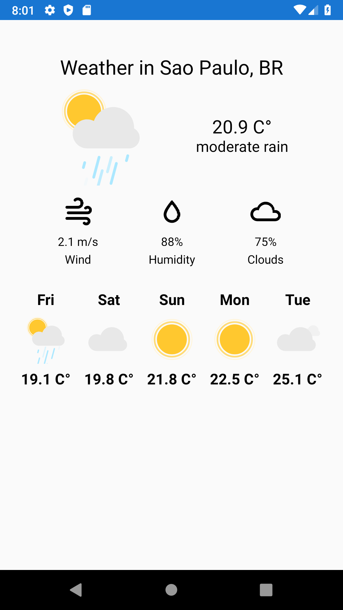

# Weather App



Fetchs the current weather and the next five days forecast for user current location

## Technical overview
This app is built with:
- [Xamarin.Forms](https://github.com/xamarin/Xamarin.Forms)
- [Lottie Xamarin](https://github.com/Baseflow/LottieXamarin)
    - All animatios are from [@jochang / LottieFiles](https://lottiefiles.com/user/26177)
- [DryIoc](https://github.com/dadhi/DryIoc)
- [Mobile.BuildTools](https://github.com/dansiegel/Mobile.BuildTools)

# Getting started
## Requiriments
Require Visual Studio and Xamarin installed to open this project.

## Installation
Clone this repository:
`$ git clone https://github.com/fernandovmp/weather-app.git` \
Open the `WeatherApp.sln` file, that can be found in the root of project, with the Visual Studio.

## Setup
- Get an api key from [Open Weather Map](https://openweathermap.org/guide)
- In the [root of shared project](./WeatherApp/WeatherApp) create a `secrets.json` file and put your api key like the example:
    ```json
    {
        "ApiKey":  "MyApiKey"
    }
    ```
